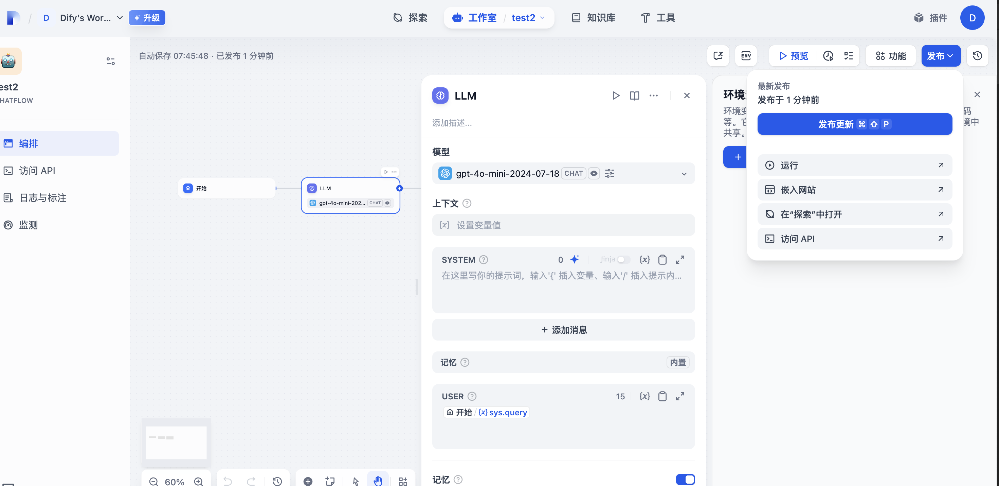

# Dify MCP Server

A TypeScript-based MCP (Model Context Protocol) server that connects the Windsurf IDE to Dify applications. This server dynamically exposes Dify applications as tools that can be used directly within the Windsurf IDE.

## Overview

This server implements the Model Context Protocol to bridge between Windsurf IDE and Dify applications. It dynamically fetches application specifications from Dify APIs and exposes them as MCP tools. The server allows users to interact with multiple Dify applications through a unified interface within the Windsurf IDE.

## Features

### Dynamic Dify Integration

- Connects to multiple Dify applications using API keys
- Automatically fetches application metadata and parameters
- Dynamically generates tool interfaces based on Dify application specifications
- Supports various input types including text, paragraphs, and select dropdowns

### Request Handling

- Robust error handling with request retries
- Support for both blocking and streaming response modes
- JSON BigInt handling for large numeric values

### Configuration

- API keys configured through environment variables
- Configurable base URL and timeout settings
- Fallback to default values when environment variables are not available

## Installation

### Prerequisites

- Node.js (v16 or higher)
- npm or yarn

### Setup

1. Clone the repository

```bash
git clone <repository-url>
cd dify-mcp-server
```

2. Install dependencies

```bash
npm install
```

3. Build the project

```bash
npm run build
```

### Integration with Windsurf IDE

To use with Windsurf IDE, add the server config to your MCP settings:

```json
https://api.dify.ai{
  "mcpServers": {
    "dify-mcp-server": {
      "command": "node",
      "args": [
        "/path/to/dify-mcp-server/build/index.js"
      ],
      "env": {
        "AGENT_API_KEYS": "key1,key2,key3",
        "BASE_URL": "https://api.dify.ai",
        "TIMEOUT": "60000"
      }
    }
  }
}
```

## Environment Variables

- `AGENT_API_KEYS`: Comma-separated list of Dify API keys
- `BASE_URL`: Base URL for Dify API(default:https://api.dify.ai)
- `TIMEOUT`: Request timeout in milliseconds (default: 60000)

## How to get Environment Variables

API密钥(AGENT_API_KEYS)： 多个以,分割




## Usage

Once configured, the Dify MCP Server will:

1. Connect to the specified Dify applications using the provided API keys
2. Fetch application metadata and parameter specifications
3. Generate MCP tool interfaces based on the Dify application configurations
4. Make these tools available within the Windsurf IDE

Each Dify application will be exposed as a separate tool with a name format of `dify_app_info_{application_name}`.

## Development

### Available Scripts

- `npm run build`: Build the project
- `npm run prepare`: Prepare the project for distribution
- `npm run watch`: Watch for changes and rebuild
- `npm run inspector`: Run the MCP inspector for debugging

### Project Structure

- `src/index.ts`: Main server implementation
- `src/request.ts`: HTTP client for Dify API communication
- `src/type.ts`: TypeScript interfaces for Dify API

## Troubleshooting

If you encounter issues:

1. Verify your API keys are correct and have the necessary permissions
2. Check that the BASE_URL is accessible from your environment
3. Review server logs for detailed error messages
4. Ensure the Dify applications are properly configured and accessible

## License

This project is licensed under the terms specified in the LICENSE file.
