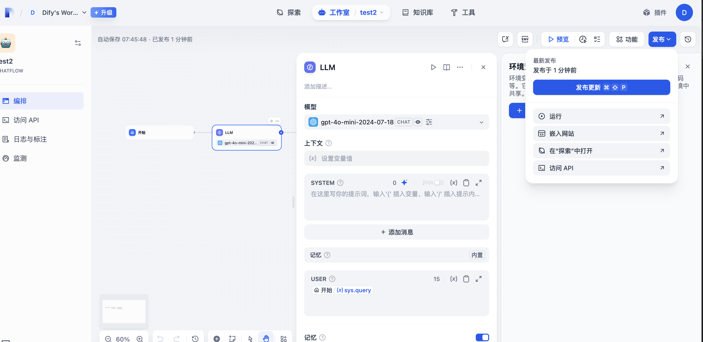
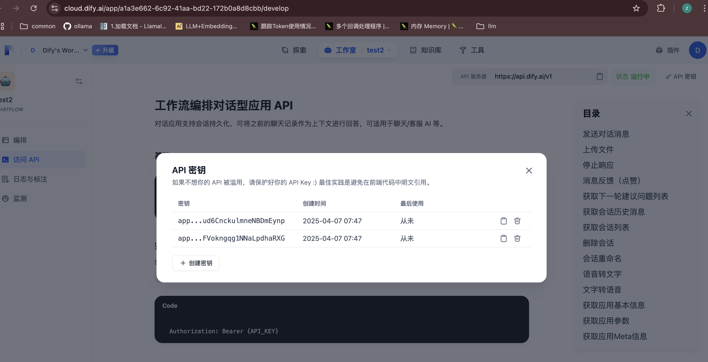

# Dify MCP 服务器


[English](README.md) | [中文](README_zh.md)

一个基于TypeScript的MCP（Model Context Protocol）服务器，用于连接MCP客户端与Dify应用程序。该服务器动态地将Dify应用程序作为工具暴露，可以直接在MCP客户端中使用。

## 概述

该服务器实现了Model Context Protocol，用于桥接MCP客户端和Dify应用程序。它动态获取Dify API的应用程序规格，并将其作为MCP工具暴露。该服务器允许用户通过MCP客户端中的统一界面与多个Dify应用程序交互。

## 功能特点

### 动态Dify集成

- 使用API密钥连接多个Dify应用程序
- 自动获取应用程序元数据和参数
- 基于Dify应用程序规格动态生成工具接口
- 支持多种输入类型，包括文本、段落和下拉选择

### 请求处理

- 强大的错误处理和请求重试机制
- 支持阻塞和流式响应模式
- 处理JSON大整数

### 配置

- 通过环境变量配置API密钥
- 可配置的基础URL和超时设置
- 当环境变量不可用时回退到默认值

## 安装

### 前提条件

- Node.js（v16或更高版本）
- npm或yarn

### 设置

1. 克隆仓库

```bash
git clone https://github.com/zhuzhoulin/dify-mcp-server.git
cd dify-mcp-server
```

2. 安装依赖

```bash
npm install
```

3. 构建项目

```bash
npm run build
```

### 与Windsurf IDE集成

要与Windsurf IDE一起使用，请将服务器配置添加到您的MCP设置中：

```json
{
  "mcpServers": {
    "dify-mcp-server": {
      "command": "node",
      "args": [
        "/path/to/dify-mcp-server/build/index.js"
      ],
      "env": {
        "AGENT_API_KEYS": "key1,key2,key3",
        "BASE_URL": "https://api.dify.ai",
        "TIMEOUT": "60000"
      }
    }
  }
}
```

## 环境变量

- `AGENT_API_KEYS`：Dify API密钥列表，以逗号分隔
- `BASE_URL`：Dify API的基础URL（默认：https://api.dify.ai）
- `TIMEOUT`：请求超时时间，以毫秒为单位（默认：60000）

## 如何获取环境变量

API密钥(AGENT_API_KEYS)：多个以逗号分割





## 使用方法

配置完成后，Dify MCP服务器将：

1. 使用提供的API密钥连接到指定的Dify应用程序
2. 获取应用程序元数据和参数规格
3. 基于Dify应用程序配置生成MCP工具接口
4. 使这些工具在Windsurf IDE中可用

每个Dify应用程序将作为一个单独的工具暴露，名称格式为`dify_app_info_{application_name}`。

## 开发

### 可用脚本

- `npm run build`：构建项目
- `npm run prepare`：准备项目分发
- `npm run watch`：监视更改并重新构建
- `npm run inspector`：运行MCP检查器进行调试

### 项目结构

- `src/index.ts`：主服务器实现
- `src/request.ts`：用于Dify API通信的HTTP客户端
- `src/type.ts`：Dify API的TypeScript接口

## 故障排除

如果遇到问题：

1. 验证您的API密钥是否正确并具有必要的权限
2. 检查BASE_URL是否可从您的环境访问
3. 查看服务器日志以获取详细的错误消息
4. 确保Dify应用程序已正确配置并可访问

## 许可证

本项目根据LICENSE文件中指定的条款获得许可。
